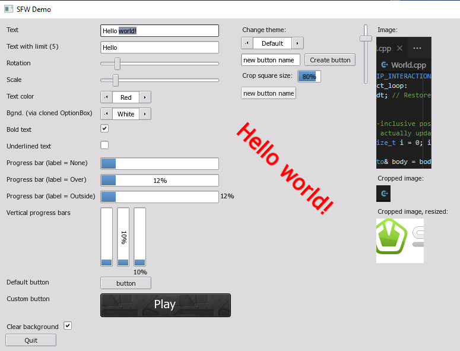

A fork of "SFML Widgets", a small & simple SFML-based GUI
=========================================================

Original (upstream) author: Alexandre Bodelot <alexandre.bodelot@gmail.com>

License: [MIT License](http://opensource.org/licenses/MIT) (See the `LICENSE` file.)

## Changes to Alex Bodelot's original:

- Adapted to the pre-3.0 SFML _("master")_ API. _(See [issue #25](https://github.com/xparq/sfw/issues/25) about minor cosmetic regressions!)_
- Windows/MSVC build added.
- Compiling as C++20 now (SFML3 is C++17 already) to embrace recent C++ features.
- Auto download & setup the latest SFML-master lib (mostly for the GitHGub workflow).
- Reshuffled the source (to help integrating into other projects & for comfy SFML inclusion).
- Small (ongoing) improvements to the API.

_For other (both planned and completed) changes see the [issues](https://github.com/xparq/sfw/issues)!_

## Quick Summary

- Small package with no external dependencies (beyond SFML & `std::`)
- Simple, straightforward API
- Spritesheet-based visuals: a single, small image file to customize widget styles (like box borders/corners etc.)
- Simple callbacks: optional lambdas (or `std::function`s) triggered on _important_ user actions (only).
  _(You can still derive from the widgets to override the other event handlers, too, of course.)_
- Easy layouts: automatically align content without the need to precalculate positions/sizes
- No CMake. (Well, that's considered a feature here; use e.g. TGUI if you can't build without CMake.)

## Build

### GCC/CLANG:

- Run `make` to build the library (`lib/libsfw.a`) & the demo (`./sfw-demo`).

### MSVC (Windows):

- Run `nmake -f Makefile.msvc` to build the lib (`lib/sfw.lib`) & the demo (`./sfw-demo.exe`).

(See the Makefiles for options.)

## Use

1. Load resources (the styling template image, font etc.) via the static `gui::Theme` class,
   customize the style properties etc.
2. Create the top-level GUI manager object, connecting it to the SFML window, like: `gui::Main myGUI(window);`.
3. Create widgets dynamically (with `new`), set their properties, add callbacks etc.
   (Note: the `Main` object's destructor will take care of deleting them.)
4. Add widgets in the usual fashion, to where they belong (their parent widgets, like layouts,
   or to the `Main` object directly).

## Details

See the headers in the [`include`](include/sfw) dir for an authoritative reference.
(They are simple, straightforward, easy to read.)

#### See also:

* the original [README](https://github.com/abodelot/sfml-widgets/blob/master/README.md) for _(now partly obsolete!)_ code examples and explanations!
* a [minimal example](doc/minimal_example.cpp)
* a fairly comprehensive example: [`demo.cpp`](src/demo.cpp)
