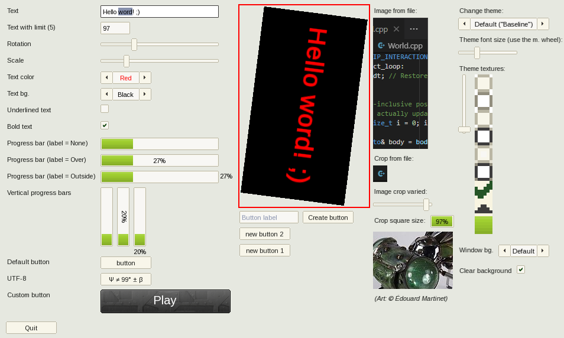

sfw::GUI - A fork of "SFML Widgets", a small & simple SFML-based GUI
====================================================================

Original (upstream) author: Alexandre Bodelot <alexandre.bodelot@gmail.com>

License: [MIT License](http://opensource.org/licenses/MIT) (See the `LICENSE` file.)

## Changes to the original:

- Adapted to the pre-3.0 ("master") SFML API
- Windows/MSVC build added
- Compiling as C++20 now (to embrace recent C++ features; SFML3 is C++17 already)
- Richer, more flexible API, bugfixes, improvements to existing widgets etc.
- Reshuffled source tree (to allow growth & to help integrating into other projects)
- Default quick-start assets included (and removed the non-free ones from the demo)
- Auto download & setup the latest SFML-master lib (mostly for the GitHub workflow)

_For other (both planned and completed) changes see the [issues](https://github.com/xparq/sfw/issues)!_

## Quick Summary

- Small package with no external dependencies (beyond SFML & `std::`)
- Simple, straightforward API
- Spritesheet-based visuals: a single, small image file to customize widget styles (like box borders/corners etc.)
- Simple callbacks: optional lambdas (or `std::function`s) triggered on _important_ user actions (only)
  _(You can still derive from the widgets to override the other event handlers, too, of course.)_
- Easy layouts: automatically align content without the need to precalculate positions/sizes
- No CMake. (Well, since I never got to learn it, now I just consider this a feature. ;)
  Use e.g. TGUI if you don't feel warm and cozy without CMake.)

## Build

### GCC/CLANG:

- Run `make` to build the library (`lib/libsfw.a`) & the demo (`./sfw-demo`).

### MSVC (Windows):

- Run `nmake -f Makefile.msvc` to build the lib (`lib/sfw.lib`) & the demo (`./sfw-demo.exe`).

(See the Makefiles for options.)

## Use

0. Integrate (via env. vars, or just copy) the `include` & `lib` dirs to your project.
   (Copy the `asset` dir, too, if you want to use the stock defaults.)
1. `#include "sfw/GUI.hpp"`.
2. Setup theme config resources (like the styling texture image, default font etc.),
   customize default style properties etc.
3. Create the top-level GUI manager object, connecting it to your SFML window, like: `sfw::GUI myGUI(window);`
   (or, typically with a customized config.: `sfw::GUI myGUI(window, myConfig);`)
4. Add containers, widgets with `...->add(sfw::SomeWidget(...))`, or if you prefer: `...->add(new sfw::OtherWidget)` calls,
   set their properties (like callbacks) etc.
   (Note: widget objects will be created and deleted implicitly.)
5. Pass events to the GUI (in your app's event loop): `myGUI.process(event);`.
6. Draw the GUI (in your frame refresh loop; or the event loop in single-treaded apps): `myGUI.render();`.
7. Have fun!

## More...

* a [minimal example](doc/minimal_example.cpp) (or [another](doc/minimal_example-polling.cpp), with a polling event loop)
* a fairly comprehensive example: [`demo.cpp`](src/demo.cpp)
* the headers in the [`include`](include/sfw) dir, for an authoritative reference (they are easy to read)
