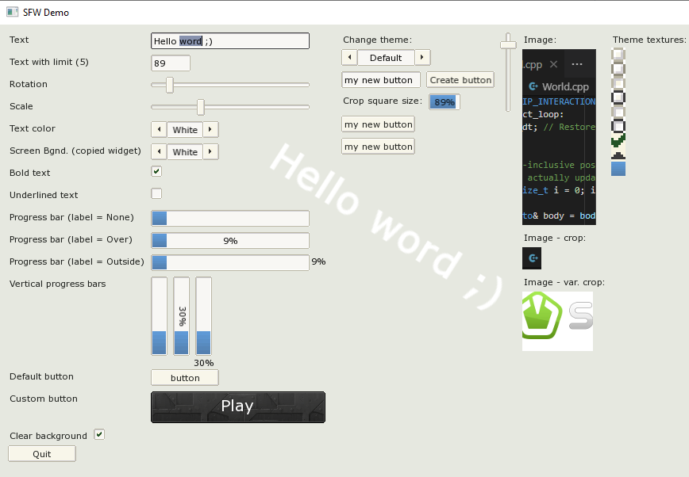

sfw::GUI - A fork of "SFML Widgets", a small & simple SFML-based GUI
====================================================================

Original (upstream) author: Alexandre Bodelot <alexandre.bodelot@gmail.com>

License: [MIT License](http://opensource.org/licenses/MIT) (See the `LICENSE` file.)

## Changes to the original:

- Adapted to the pre-3.0 SFML _("master")_ API. _(See minor cosmetic regression #25!)_
- Windows/MSVC build added.
- Compiling as C++20 now (to embrace recent C++ features; SFML3 is C++17 already).
- Auto download & setup the latest SFML-master lib (mostly for the GitHGub workflow).
- Cleaner API, improvements to existing widgets etc.
- Reshuffled source tree (to help integrating into other projects, to allow growth, to "host" SFML locally).

_For other (both planned and completed) changes see the [issues](https://github.com/xparq/sfw/issues)!_

## Quick Summary

- Small package with no external dependencies (beyond SFML & `std::`)
- Simple, straightforward API
- Spritesheet-based visuals: a single, small image file to customize widget styles (like box borders/corners etc.)
- Simple callbacks: optional lambdas (or `std::function`s) triggered on _important_ user actions (only).
  _(You can still derive from the widgets to override the other event handlers, too, of course.)_
- Easy layouts: automatically align content without the need to precalculate positions/sizes
- No CMake. (Well, that's considered a feature here; use e.g. TGUI if you can't build without CMake.)

## Build

### GCC/CLANG:

- Run `make` to build the library (`lib/libsfw.a`) & the demo (`./sfw-demo`).

### MSVC (Windows):

- Run `nmake -f Makefile.msvc` to build the lib (`lib/sfw.lib`) & the demo (`./sfw-demo.exe`).

(See the Makefiles for options. The MSVC variant is rather dumb yet!)

## Use

0. `#include "sfw/GUI.hpp"`
1. Load resources (the styling template image, font etc.) via the static `sfw::Theme` class,
   customize the style properties etc.
2. Create the top-level GUI manager object, connecting it to the SFML window, like: `sfw::GUI my_GUI(window);`.
3. Create widgets with `new`, set their properties, add callbacks etc.
   (Note: the `Main` object's destructor will take care of deleting them.)
4. Add widgets to various containers (layouts, incl. the root object) like: `someplace.add(my_widget)`).
5. In your app's event loop pass events to the GUI: `my_GUI.process(event);`.
6. Draw the GUI in your frame refresh loop: `my_GUI.render();`.
7. Have fun!

## More...

* a [minimal example](doc/minimal_example.cpp)
* a fairly comprehensive example: [`demo.cpp`](src/demo.cpp)
* the headers in the [`include`](include/sfw) dir, for an authoritative reference (they are easy to read)
